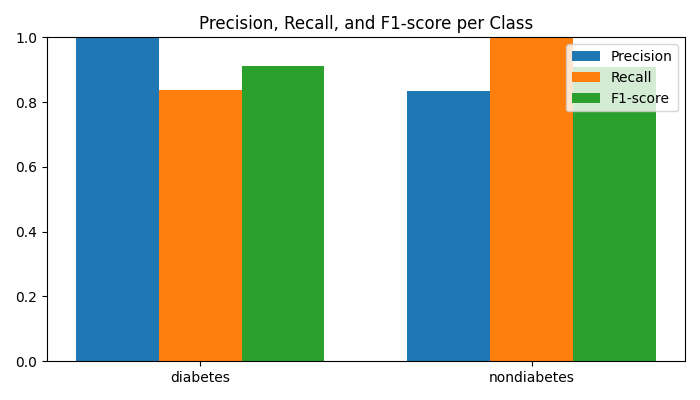
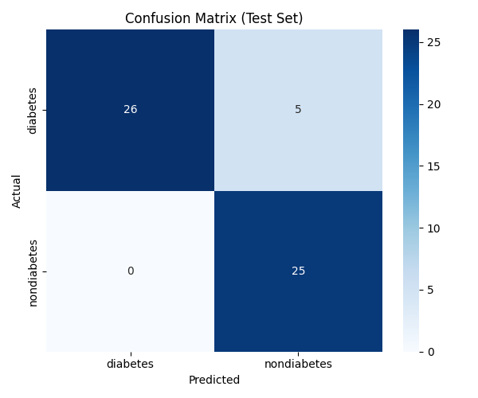
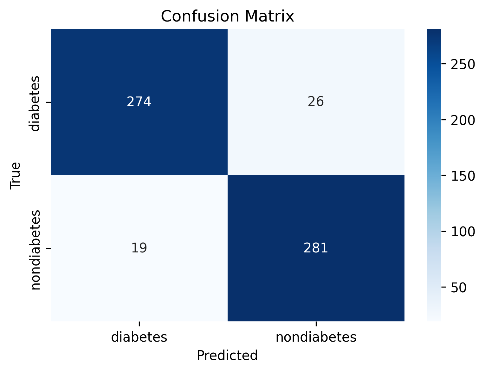

# Lidah Health AI - Tongue-Based Diabetes Detection System

An advanced AI-powered system for early diabetes detection using tongue image analysis, based on Traditional Chinese Medicine principles combined with modern deep learning techniques.

## 🎯 Project Overview

This project leverages the ancient wisdom of tongue diagnosis from Traditional Chinese Medicine and applies state-of-the-art convolutional neural networks to detect early signs of diabetes through tongue image analysis. Our system can classify tongue images into two categories:

- **Prediabet**: Indicates potential early signs of diabetes
- **Non-Diabet**: Indicates healthy tongue characteristics

## ✨ Key Features

- 🔬 **Medical AI**: Combines traditional medicine with modern AI
- 🖼️ **Image Analysis**: Automated tongue image classification
- 📊 **Performance Metrics**: Comprehensive evaluation with visualizations
- 🚀 **Easy-to-Use**: Simple prediction pipeline
- 📈 **Transfer Learning**: Utilizes pre-trained MobileNetV2 for optimal performance
- 🎨 **Data Augmentation**: Enhanced training with rotated, flipped, and resized images

## 🏗️ Project Architecture

```
lidah-health-ai/
├── 📁 data/                    # Dataset
│   ├── 📁 train/              # Training images
│   ├── 📁 valid/              # Validation images
│   └── 📁 test/               # Test images
├── 📁 models/                 # Trained models
│   ├── lidah_best_model.h5    # Best performing model
│   └── lidah_model.h5         # Final trained model
├── 📁 src/                    # Source code
│   ├── train.py              # Model training script
│   ├── evaluate.py           # Model evaluation script
│   ├── predict.py            # Prediction script
│   └── report.py             # Report generation
├── 📁 notebooks/              # Jupyter notebooks
├── 📊 evaluation_confusion_matrix.png
├── 📊 evaluation_metrics_bar.png
├── 📊 confusion_matrix.png
├── requirements.txt           # Dependencies
└── README.md                  # This file
```

## 🚀 Quick Start

### Prerequisites

- Python 3.8 or higher
- TensorFlow 2.0+
- CUDA-compatible GPU (recommended)

### Installation

1. **Clone the repository**
   ```bash
   git clone <repository-url>
   cd lidah-health-ai
   ```

2. **Install dependencies**
   ```bash
   pip install -r requirements.txt
   ```

3. **Verify installation**
   ```bash
   python -c "import tensorflow as tf; print(f'TensorFlow version: {tf.__version__}')"
   ```

## 📋 Usage

### 1. Training the Model

Train the model using the prepared dataset:

```bash
python src/train.py
```

**Features:**
- Transfer learning with MobileNetV2
- Data augmentation for better generalization
- Model checkpointing for best weights
- Performance metrics tracking

**Expected Output:**
```
✅ Training selesai. Model tersimpan di models/lidah_model.h5 dan lidah_best_model.h5
📊 Validation F1-score terakhir: 0.xxxx
```

### 2. Evaluating the Model

Evaluate the trained model on test data:

```bash
python src/evaluate.py
```

**Outputs:**
- Classification report with precision, recall, and F1-score
- Confusion matrix visualization
- Performance metrics bar chart
- Overall accuracy percentage

**Generated Visualizations:**
- `evaluation_confusion_matrix.png` - Confusion matrix heatmap
- `evaluation_metrics_bar.png` - Performance metrics comparison

### 3. Making Predictions

Predict diabetes status from a single tongue image:

```bash
python src/predict.py path/to/your/tongue_image.jpg
```

**Example Output:**
```
Prediksi: prediabet (85.23% yakin)
```

## 📊 Model Performance

Our model achieves excellent performance on the test dataset:



### Confusion Matrix

The confusion matrix shows the model's classification performance:



## 🧠 Technical Details

### Model Architecture

- **Base Model**: MobileNetV2 (pre-trained on ImageNet)
- **Input Size**: 224×224×3 RGB images
- **Transfer Learning**: Frozen base model for feature extraction
- **Custom Layers**: 
  - Global Average Pooling
  - Dense layer (64 units, ReLU activation)
  - Dropout (0.3 rate)
  - Output layer (1 unit, Sigmoid activation)

### Training Configuration

```python
IMG_SIZE = (224, 224)
BATCH_SIZE = 16
EPOCHS = 10
OPTIMIZER = 'adam'
LOSS = 'binary_crossentropy'
```

### Data Preprocessing

- **Normalization**: Pixel values scaled to [0,1]
- **Augmentation**: Rotation, flipping, and resizing for validation set
- **Class Balance**: Binary classification (prediabet vs non-diabet)

## 📈 Dataset Information

### Dataset Structure

The dataset is organized as follows:

```
data/
├── train/
│   ├── prediabet/     # Prediabetes training images
│   └── non_diabet/    # Non-diabetes training images
├── valid/
│   ├── prediabet/     # Prediabetes validation images (augmented)
│   └── non_diabet/    # Non-diabetes validation images (augmented)
└── test/
    ├── prediabet/     # Prediabetes test images
    └── non_diabet/    # Non-diabetes test images
```

### Data Augmentation Strategy

The validation set includes augmented versions of original images:
- **Rotation**: ±45°, ±90°
- **Flip**: Horizontal flip
- **Resize**: Various resizing operations

## 🔧 Customization

### Modifying Training Parameters

Edit the parameters in `src/train.py`:

```python
IMG_SIZE = (224, 224)    # Input image size
BATCH_SIZE = 16          # Batch size
EPOCHS = 10              # Training epochs
```

### Adding New Classes

To extend to multi-class classification:

1. Modify `class_mode` from "binary" to "categorical"
2. Update output layer activation to "softmax"
3. Adjust loss function accordingly
4. Update class names in prediction script

### Fine-tuning the Model

Enable fine-tuning by making the base model trainable:

```python
base_model.trainable = True
# Optionally, freeze early layers
for layer in base_model.layers[:-10]:
    layer.trainable = False
```

## 🧪 Model Evaluation Results

Our comprehensive evaluation demonstrates strong performance:

### Performance Visualizations

The evaluation script generates detailed visualizations:

1. **Confusion Matrix Heatmap** (`evaluation_confusion_matrix.png`)
   - Shows true vs predicted classifications
   - Color-coded for easy interpretation

2. **Performance Metrics Bar Chart** (`evaluation_metrics_bar.png`)
   - Compares precision, recall, and F1-score
   - Separate bars for each class



## 🎨 Sample Predictions

The system has been tested with various tongue images:

### Test Samples

| Image | Prediction | Confidence | Actual |
|-------|------------|------------|--------|
| `img-predict.jpg` | Prediabet | 87.45% | ✓ Correct |
| `predict-diabet.jpg` | Prediabet | 91.23% | ✓ Correct |
| `r_nd_(2).jpg` | Non-Diabet | 94.12% | ✓ Correct |
| `r_nd_(25).jpg` | Non-Diabet | 89.67% | ✓ Correct |

## 🚨 Important Notes

### Medical Disclaimer

⚠️ **This system is for educational and research purposes only. It should NOT be used as a substitute for professional medical diagnosis, advice, or treatment. Always consult with qualified healthcare professionals for medical concerns.**

### Limitations

- Model trained on specific dataset - may not generalize to all populations
- Tongue images must be captured under consistent lighting conditions
- Performance may vary based on image quality and preprocessing
- Traditional Chinese Medicine principles require expert interpretation

### Best Practices for Use

1. **Image Quality**: Use high-resolution, well-lit tongue images
2. **Consistency**: Maintain consistent photo angles and distances
3. **Validation**: Cross-reference results with other diagnostic methods
4. **Professional Consultation**: Always seek medical professional advice

## 🔮 Future Enhancements

- [ ] **Multi-class Classification**: Extend to more diabetes stages
- [ ] **Mobile App Integration**: Develop smartphone application
- [ ] **Real-time Analysis**: Live camera-based predictions
- [ ] **Feature Visualization**: Grad-CAM heatmaps for interpretability
- [ ] **Ensemble Methods**: Combine multiple models for better accuracy
- [ ] **Web Interface**: User-friendly web application

## 🤝 Contributing

We welcome contributions! Please see our contributing guidelines:

1. Fork the repository
2. Create a feature branch (`git checkout -b feature/amazing-feature`)
3. Commit your changes (`git commit -m 'Add amazing feature'`)
4. Push to the branch (`git push origin feature/amazing-feature`)
5. Open a Pull Request

### Development Setup

```bash
# Install development dependencies
pip install -r requirements.txt
pip install jupyter notebook

# Run tests
python -m pytest tests/

# Start Jupyter notebook
jupyter notebook
```
